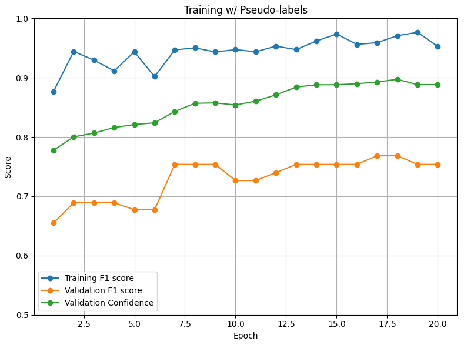

# Semi-Supervised Image Classification: Flooded vs. Non-Flooded Aerial Images

This project implements a **semi-supervised learning (SSL)** approach to classify aerial images captured by UAVs after a hurricane into two categories: **Flooded** and **Non-Flooded**. The primary challenge is effectively leveraging both labeled and unlabeled data to improve classification accuracy without overfitting to the small labeled dataset.

---

## Dataset

Source: [FloodNet Challenge on Kaggle](https://www.kaggle.com/datasets/aletbm/aerial-imagery-dataset-floodnet-challenge)

- **Labeled Data**: Contains ground-truth annotations for "Flooded" and "Non-Flooded" classes. Used stratified split (80/20) to keep a validation dataset for final model evaluation.
- **Unlabeled Data**: No labels available; used for pseudo-label generation in SSL.
- **Test Data**: Held-out dataset for final inference; also unlabeled.

---

## Project Goals

1. **Develop a robust classifier** using limited labeled data.
2. **Incorporate unlabeled data** using pseudo-labeling to enhance learning.
3. **Track model quality** using F1 score/average confidence on labeled validation data.
4. **Address class imbalance** using sampling and weighted loss techniques.

---

## Model Overview

- **Backbone**: Pretrained **Vision Transformer (ViT-Base, Patch16)** via transfer learning.
- **Head**: Replaced final classification layer with a task-specific fully connected head.
- **Fine-tuning**: End-to-end training on both labeled and pseudo-labeled data.

---

## Training Strategy

### Phase 1: Base Training on Labeled Data
- **Optimizer**: AdamW  
- **Loss**: Weighted CrossEntropyLoss  
- **Scheduler**: ReduceLROnPlateau (patience = 3)  
- **Augmentation**:  
  - Horizontal Flip  
  - Vertical Flip  
  - Random Rotation  
  - Color Jitter  
  - Normalize  
- **Imbalance Handling**:
  - `WeightedRandomSampler` for balanced batches  
  - Class weights in loss function to penalize underrepresented class
  
## Performance

### Best Model Metrics (Epoch 17)
- **Training Accuracy**: 94.34%  
- **Training F1 Score**: **0.9429**  

### Phase 2: Semi-Supervised Retraining with Pseudo-Labels
1. Generate high-confidence pseudo-labels for the unlabeled set using the trained model. Used a confidence threshold of 90% on the model probability output to add to pseudo-labeled dataset.
2. Merge pseudo-labeled data with original labeled dataset.
3. Retrain the initial model with this combined dataset.
4. Save the best model based on **validation F1 score**.

---

## Performance

### Best Model Metrics (Epoch 4)
- **Validation Accuracy**: 91.25%  
- **Validation F1 Score**: **0.9196**  
- **Average Confidence**: **0.9332**

### Final Epoch (20)
- **Validation Accuracy**: 90.00%  
- **Validation F1 Score**: 0.9093  
- **Average Confidence**: **0.9485**

The model achieved **excellent generalization** with stable validation F1 and steadily increasing prediction confidence, indicating strong pseudo-label reliability.

---

## 🔮 Future Work

1. Implement advanced SSL techniques:
   - [ ] Mean Teacher  
   - [ ] FixMatch  
   - [ ] Consistency regularization  
2. Compare ViT performance with CNN-based backbones (e.g., **ResNet**, **EfficientNet**).
3. Calibrate or tune pseudo-labeling confidence thresholds to optimize label quality/coverage trade-off.

