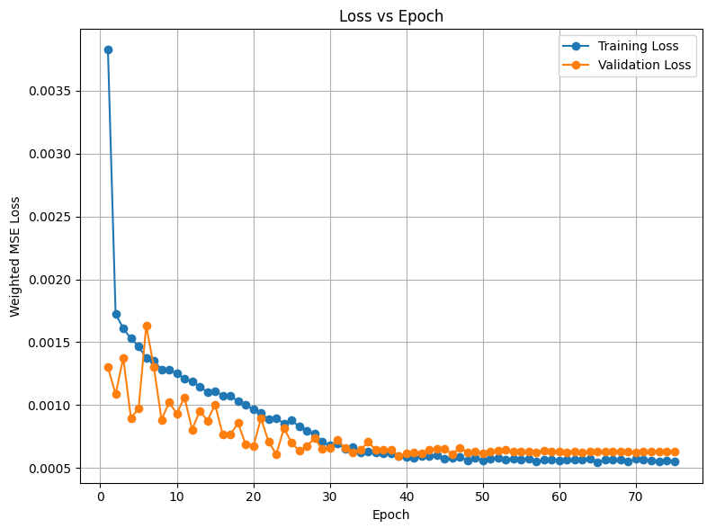
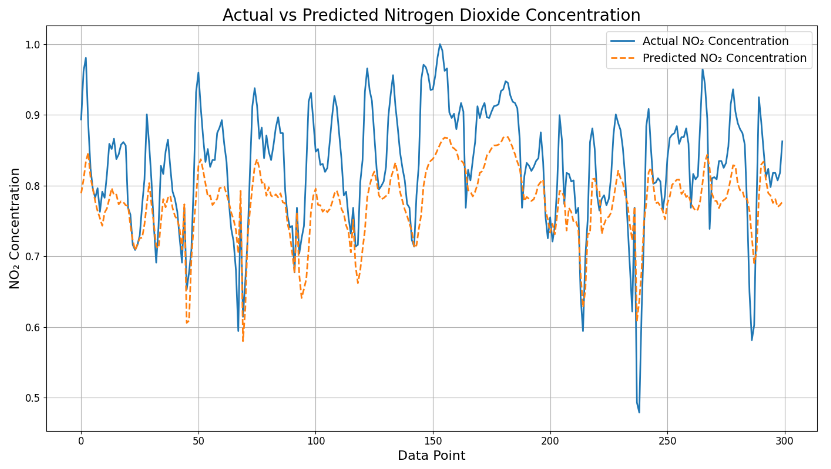

# Nitrogen Dioxide Concentration Forecasting using LSTM/GRU-based Time Series Models

This project implements and compares LSTM (Long Short-Term Memory) and GRU (Gated Recurrent Unit) models for time-series prediction of nitrogen dioxide concentration. 

## Goals

- Build a time series model to predict hourly NO₂ concentration levels.
- Improve model performance through hyperparameter tuning, data preprocessing, and custom loss functions.
- Accurately capture both typical trends and high-concentration outliers in the target variable.

## Dataset Description

The dataset (from https://www.kaggle.com/datasets/dakshbhalala/uci-air-quality-dataset) contains 12 numerical sensor and pollutant readings (e.g., CO, NMHC, Benzene) spanning **1 year** with **24 data points per day**. 

## Data Preprocessing

1. **Missing Value Handling**: Imputed using column means.
2. **Scaling**:
   - `MinMaxScaler` used initially.
   - Switched to **log transformation** for the target variable to improve performance on very small and very large concentration values.
3. **Cyclical Features**:
   - Encoded `hour`, `day of week`, and `month` using sine and cosine transforms to preserve temporal continuity.
4. **Train/Validation/Test Split**: Sequential split respecting time order.

## Model Architectures

### LSTM Model
The LSTM model captures long-term dependencies in time-series data using memory cells and gates.

### GRU Model
The GRU model is a simpler alternative to LSTM with fewer parameters, relying on reset and update gates for sequence modeling.

### Common Features
- Input: A sequence of historical values with `sequence_length` (e.g., 168 time steps for 1 week).
- Output: The next set of predicted values (multivariate prediction for 3 features).
- Architecture:
  - Input Layer
  - Multiple Recurrent Layers (LSTM or GRU)
  - Dropout (0.4 for regularization)
  - Fully Connected Output Layer
- Activation Functions: ReLU for intermediate layers, linear for output.

## Hyperparameters
- Sequence Length: Tested multiple values, such as 12, 24, 48, and 168.
- Hidden Sizes: [16, 32, 48]
- Number of Layers: [1, 2, 3]
- Batch Sizes: [4, 8, 16, 32]
- Learning Rate: 0.001
- Weight Decay: 0.01 (L2 regularization)
- Optimizer: AdamW
- Regularization: Dropout (0.4)

## Custom Weighted MSE Loss

To handle underperformance on low/high concentration outliers, a **Weighted MSE Loss** was introduced that doubled the weight of target values which were larger than the 75th percentile NO2 concentration value.

## Training
- Training was conducted for **75 epochs**.
- A **ReduceLROnPlateau** scheduler was used to dynamically adjust the learning rate when validation loss plateaued for 4 straight epochs.
- Best model weights were saved during training based on validation loss.

### Metrics
Three metrics were used for evaluation:
1. **Mean Squared Error (MSE)**: Measures average squared differences.
2. **Mean Absolute Error (MAE)**: Measures average absolute differences.
3. **R-squared (R²)**: Indicates the proportion of variance explained by the model.

## Results

| Model      | Hidden Size | Layers | Batch Size | MSE (Test) | MAE (Test) | R² (Test) |
|------------|-------------|--------|------------|------------|------------|-----------|
| LSTM       | 24          | 2      | 4          | 0.0010     | 0.0454     | 0.5305    |

### Observations
- The **LSTM model** slightly outperformed the GRU model in terms of MSE, MAE, and R².
- Performance improvements stabilized around 40 epochs for both the training and validation sets.

## Key Design Decisions
1. **Comparison of Models**: Both GRU and LSTM were tested to assess which model handled the task better.
2. **Dynamic Learning Rate**: A scheduler adjusted the learning rate based on validation loss to ensure stable convergence.
3. **Evaluation Metrics**: Multiple metrics were employed to provide a comprehensive understanding of the model's performance.
4. **Log-transforming** the target helped reduce skew and improve regression stability.
5. The **weighted loss** significantly boosted performance on critical outliers.

## Predicted vs Actual Values
Plotting the actual versus predicted values shows that the model has a tendency to under-estimate larger cocentration values, but is handling smaller values relatively well. Further tuning of the threshold used in the weighted MSE loss could potentially improve this behavior.

## Future Work
- **Explore Deeper Architectures**: Investigate deeper LSTM and GRU architectures for further improvements.
- **Attention Mechanisms**: Integrate attention-based models to improve sequence-to-sequence learning.

