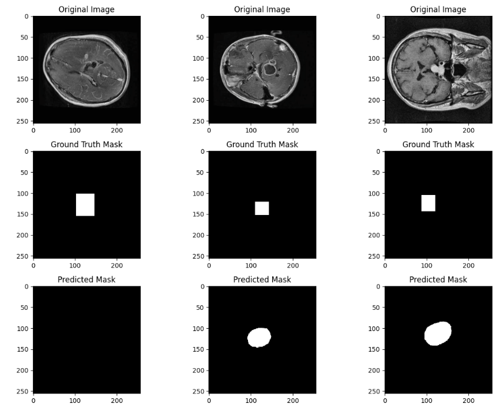

# Semantic segmentation of brain tumors from CT scans using a UNet with a ResNet18 encoder.

## Task Description
The objective of this project is to perform semantic segmentation on brain CT scans ([dataset link](https://www.kaggle.com/datasets/pkdarabi/brain-tumor-image-dataset-semantic-segmentation/data)) to identify and segment tumor regions.  
The dataset consists of grayscale images and corresponding masks, where pixel values indicate the presence or absence of a tumor.

## Approach

### Model
- Transfer learning was applied using a **UNet** architecture with a **ResNet18** encoder backbone pre-trained on ImageNet.
- The final layers were adapted for **binary semantic segmentation** (tumor vs. background).

### Data Preprocessing & Augmentation
- All images and masks were **resized to 256×256** pixels.
- During experiments, varying resize values such as **384×384** and **512×512** were also tested.  
  It was found that **256×256** yielded the best performance considering segmentation quality and training stability.
- Augmentations applied:
  - Random horizontal and vertical flips
  - Random small rotations
  - Random translations
  - Color jitter for slight intensity variations
- Images were normalized using **ImageNet** mean and standard deviation.

### Loss Function Exploration
Multiple loss functions were tested:
- **Dice Loss** alone (good recall, low precision)
- **Combined Dice and Binary Cross Entropy Loss (BCE)** — best visual segmentations and best quantitative results
- **Combined Dice and Focal Loss** — slightly better recall than pure Dice, but less stable precision

The **final loss function** selected was:
> **Combined Dice + BCE Loss** (with `dice_weight = 0.75` and `ce_weight = 1.25`)

This combination helped balance **boundary accuracy** (Dice) and **pixelwise classification** (BCE), addressing both small tumor regions and background balance.

### Learning Rate Schedulers
Two learning rate strategies were employed:
- **Warmup Phase:**  
  The learning rate was linearly increased during the first few epochs to allow stable initial convergence and prevent early optimizer instability.
- **Reduce on Plateau:**  
  After warmup, the learning rate was **automatically reduced by a factor of 0.5** if the validation loss did not improve for 3 consecutive epochs.  
  This helped fine-tune the model toward a better minimum without overshooting.

### Training Details
- **Loss Function:** Combined Dice and BCE Loss
- **Optimizer:** AdamW
- **Batch Size:** 16
- **Initial Learning Rate:** 0.0001
- **Weight Decay:** 0.01
- **Epochs:** 20 total
- **Scheduler:** Warmup for first few epochs, then ReduceLROnPlateau

## Results

### Training, Validation, and Test Set
- Validation loss consistently improved over the first 10–11 epochs, but then plateaud. This was a consistent trend throughout many of the different hyperparameter combinations tested.
- The best validation model was saved and evaluated on the test set.

**Final test set performance:**
- **Average Test Dice Loss:** 0.7768
- **Test Precision:** 0.1392
- **Test Recall:** 0.3479
- **Test F1 Score:** 0.1988

### Example Predictions
- Some sample predictions show the model successfully identifies tumor regions but struggles with extremely small or irregular tumors.

---

## Observations & Next Steps
- Although performance is modest (low precision but decent recall), it aligns with expectations given the challenging nature of binary tumor segmentation.
- Higher input image resolutions (e.g., 384×384 or 512×512) did not outperform 256×256 resizing, possibly due to GPU memory constraints and dataset size.
- More extensive training (e.g., 40–50 epochs) and larger batch sizes could improve segmentation stability and precision.
- Exploring alternative backbones (e.g., **EfficientNet**, **ConvNeXt**) or architectures (e.g., **DeepLabV3+**) could further enhance results.
- Future work could also involve implementing **test-time augmentations** and **pseudo-labeling** to boost segmentation generalization.

