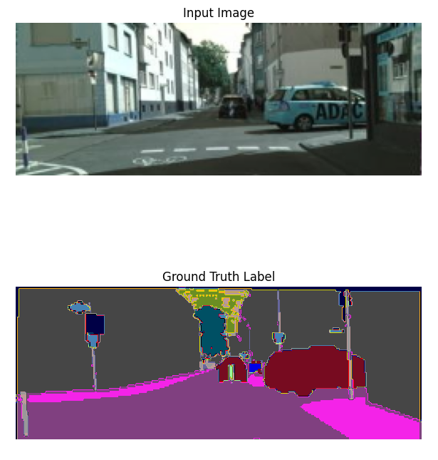
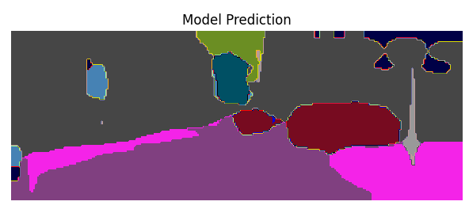

# Cityscapes Semantic Segmentation Project

## Project Overview
This project performs semantic segmentation on the **Cityscapes dataset** using **DeepLabV3** with a **ResNet50 backbone**. The model is trained to classify each pixel into its corresponding object class using a combination of **Focal Loss** and **Dice Loss** to improve boundary segmentation performance.

## Dataset: Cityscapes
The Cityscapes dataset consists of street scene images with high-quality pixel-level annotations. It includes 30 classes, but for training, only a subset of them is typically used.

### Pixel-to-Class Mapping
The original Cityscapes dataset provides labels as RGB images, where each pixel color corresponds to a class ID. A mapping is used to convert these colors into numerical class labels suitable for training. I ran into some issues where the mapping seems to struggle along the borders of certain objects. I was not able to resolve this issue, which can be seen in the images below.

| Color (RGB) | Class Name      | Train ID |
|------------|---------------|---------|
| (128, 64, 128) | Road         | 0 |
| (244, 35, 232) | Sidewalk     | 1 |
| (70, 70, 70)   | Building     | 2 |
| (102, 102, 156) | Wall        | 3 |
| (190, 153, 153) | Fence       | 4 |
| (153, 153, 153) | Pole        | 5 |
| (250, 170, 30)  | Traffic Light | 6 |
| (220, 220, 0)   | Traffic Sign  | 7 |
| (107, 142, 35)  | Vegetation   | 8 |
| (152, 251, 152) | Terrain      | 9 |
| (0, 130, 180)   | Sky         | 10 |
| (220, 20, 60)   | Pedestrian  | 11 |
| (255, 0, 0)     | Rider       | 12 |
| (0, 0, 142)     | Car         | 13 |
| (0, 0, 70)      | Truck       | 14 |
| (0, 60, 100)    | Bus         | 15 |
| (0, 80, 100)    | Train       | 16 |
| (0, 0, 230)     | Motorcycle  | 17 |
| (119, 11, 32)   | Bicycle     | 18 |

## Model: DeepLabV3 (Transfer Learning)
- Used **DeepLabV3** with a **ResNet-50 backbone** pre-trained on ImageNet.
- Modified the final classification layer to match the number of classes in the Cityscapes dataset.
- Applied **transfer learning** by freezing early convolutional layers and fine-tuning deeper layers.

## Training Configuration
- **Optimizer**: AdamW
- **Initial Learning Rate**: 0.0005 (with warmup)
- **Scheduler**: ReduceLROnPlateau (factor = 0.5, patience = 3 epochs)
- **Batch Size**: 32
- **Weight Decay**: 0.001
- **Loss Function**: Weighted Focal/Dice Loss  
  - **Focal Loss** (weighted 1.5)  
  - **Dice Loss** (weighted 1.0)  

## Results
- Originally used CrossEntropyLoss as a baseline
- **Best Validation Dice Score w/ CrossEntropy loss**: **0.72**
- **Best Validation Dice Score w/ Weighted loss**: **0.76**
- **Best Validation Loss**: **1.4726** (Epoch 11)
- Increasing the focal loss weight improved boundary details.
- Model successfully segments roads, buildings, and vegetation but has slight difficulty with thin objects like poles.

## Next Steps
- Further refine the balance between Dice Loss and Focal Loss.
- Apply additional post-processing techniques like **CRF-based refinement**.
- Experiment with different backbones like ResNet101 or ConvNeXt.

- An example of an original image, the ground truth, and prediction can be seen below:

