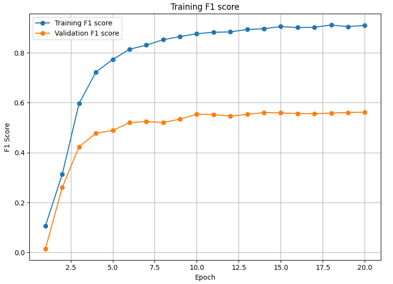
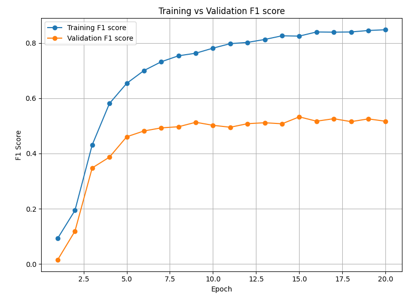

# Ensemble GI Imaging Classification using Transfer Learning

## Project Overview
This project focuses on classifying gastrointestinal (GI) images using transfer learning with Vision Transformers (ViT-16) and ConvNeXt models. Once both of these models were trained, their outputs were ensembled to make predictions on the test set. The dataset used is the HyperKvasir dataset (https://datasets.simula.no/hyper-kvasir/), which consists of labeled GI tract images. As with many medical datasets, there was significant class imbalance prompting the use of several techniques for improving model performance and generalization.

## Dataset
The dataset used for this project is the **HyperKvasir** dataset, which contains 23 categories of GI tract images such as Barrett's Esophagus, Polyps, Esophagitis, Ulcerative Colitis, and more. Some of these categories contain several training images (400+ samples), while others are severely lacking (< 10 samples).

## Data Preprocessing & Augmentation
A **stratified split** was performed to divide the dataset into training, validation, and test sets while maintaining the class distribution.

To enhance model robustness, the following data augmentation techniques were applied to the training data:
- **Random Rotation**
- **Horizontal Flip**
- **Color Jitter**
- **Gaussian Blur**

## Class Imbalance Handling
To address class imbalance, the following techniques were implemented:
- **Weighted Cross Entropy Loss Function**: Assigning higher weights to minority classes.
- **Oversampling**: Using `WeightedRandomSampler` to ensure underrepresented classes were adequately sampled during training.
- **Gradient Accumulation**: Accumulate gradients over two steps to simulate a larger batch size that contains more minority class samples.
- **F1-macro score**: Primary metric for evaluating performance due to its proper evaluation of performance with heavy class imbalance.

## Model Selection & Training
Two models were individually trained using transfer learning:
- **Vision Transformer (ViT-16)**
- **ConvNeXt**

Each model was initialized with pre-trained ImageNet weights and fine-tuned on the HyperKvasir dataset.

### Hyperparameters
- **Batch Size**: 64
- **Gradient Accumulation Step Size**: 2 (making equivalent batch size 128)
- **Optimizer**: AdamW
- **Initial Learning Rate**: 0.001
- **Learning Rate Warmup**: 3 epochs
- **Learning Rate Scheduler**: ReduceLROnPlateau (factor=0.5, patience=5)
- **Epochs**: 20
- **Weight Decay**: 0.01
- **Loss Function**: Cross-Entropy with Class Weights

## Training Results
### Individual Model Performance
#### ViT-16:
- **Best Validation F1-macro Score**: 0.5624  

#### Conv-Next:
- **Best Validation F1-macro Score**: 0.5326  

### Ensemble Performance
The ensemble of both models was evaluated on the test set, yielding the following metrics:
- **Test Accuracy**: 0.8210
- **Test Precision**: 0.5631
- **Test Recall**: 0.6126
- **Test F1 Score**: 0.5655

## 📊 Per-Class Metrics

| Class                             | Precision | Recall | F1-Score | Support |
|----------------------------------|-----------|--------|----------|---------|
| barretts                         | 0.08      | 0.25   | 0.12     | 4       |
| barretts-short-segment           | 0.10      | 0.40   | 0.15     | 5       |
| bbps-0-1                         | 0.98      | 0.97   | 0.98     | 64      |
| bbps-2-3                         | 1.00      | 0.84   | 0.91     | 113     |
| cecum                            | 0.98      | 0.96   | 0.97     | 100     |
| dyed-lifted-polyps               | 0.88      | 0.85   | 0.87     | 99      |
| dyed-resection-margins          | 0.87      | 0.88   | 0.87     | 98      |
| esophagitis-a                    | 0.36      | 0.45   | 0.40     | 40      |
| esophagitis-b-d                  | 0.65      | 0.77   | 0.70     | 26      |
| hemorrhoids                      | 0.00      | 0.00   | 0.00     | 1       |
| ileum                            | 0.00      | 0.00   | 0.00     | 1       |
| impacted-stool                  | 0.43      | 1.00   | 0.60     | 13      |
| polyps                           | 0.96      | 0.83   | 0.89     | 102     |
| pylorus                          | 0.98      | 0.97   | 0.97     | 99      |
| retroflex-rectum                 | 0.78      | 0.97   | 0.86     | 39      |
| retroflex-stomach                | 1.00      | 0.96   | 0.98     | 75      |
| ulcerative-colitis-grade-0-1    | 0.00      | 0.00   | 0.00     | 4       |
| ulcerative-colitis-grade-1      | 0.43      | 0.90   | 0.58     | 20      |
| ulcerative-colitis-grade-1-2    | 0.00      | 0.00   | 0.00     | 1       |
| ulcerative-colitis-grade-2      | 0.83      | 0.43   | 0.57     | 44      |
| ulcerative-colitis-grade-2-3    | 0.25      | 0.33   | 0.29     | 3       |
| ulcerative-colitis-grade-3      | 0.48      | 0.77   | 0.59     | 13      |
| z-line                           | 0.93      | 0.55   | 0.69     | 92      |

**Overall Test Metrics**:
- **Accuracy**: 0.8210  
- **Macro Average F1**: 0.5655  
- **Macro Precision**: 0.5631  
- **Macro Recall**: 0.6126  
- **Weighted Average F1**: 0.83

The test accuracy is high due to the excellent performance on well represented classes, such as "cecum". The precision/recall/F1-score are much lower due to the model struggling to classify some of the classes with fewer samples, such as "barretts".

## Conclusion
This project applied transfer learning to classify GI tract images. Despite the class imbalance, the use of weighted loss functions and oversampling techniques helped improve model performance. As expected, the model's output was significantly better for classes that were well represented in the dataset.

---
**Future Work:**
- Experiment with class-specific augmentation techniques for classes with very low representation.
- Fine-tune hyperparameters further for improved generalization
- Train the individual models for a longer time

