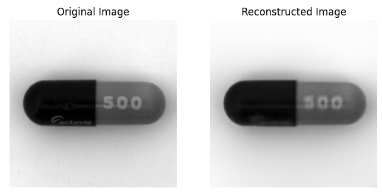

# Autoencoder for Anomaly Detection in Manufacturing Images

This project implements an autoencoder-based approach for unsupervised anomaly detection in drug capsule manufacturing images. The model is trained to reconstruct normal samples, and deviations in reconstruction quality are used to identify potential anomalies.

## MVTEC Anomaly Detection Dataset Citation
Paul Bergmann, Michael Fauser, David Sattlegger, and Carsten Steger,
"A Comprehensive Real-World Dataset for Unsupervised Anomaly Detection",
IEEE Conference on Computer Vision and Pattern Recognition, 2019

## Project Summary

- **Goal**: Detect anomalies in drug capsule images by identifying high reconstruction errors from an autoencoder model.

- **Dataset**:
  - Using a subset of the MVTEC dataset that features images of drug capsules.
  - Training set contains 219 clean (non-defective) images captured under consistent conditions (distance, orientation, etc.).
  - Test dataset includes both normal and anomalous samples (e.g., cracks, contamination, or foreign objects)..
  - Split the training images into a training and validation set (80/20 split).

## Autoencoder Design
- **Architecture**:
  - **Encoder**:
    - 4 convolutional layers with strided convolutions for downsampling.
    - Channel progression: 1->32->64->128->256.
    - ReLU activation and Batch Normalization after each convolution.
    - Slight dropout of 0.1 applied to encoder to prevent overfitting.
  - **Decoder**:
    - 4 deconvolutional layers mirroring the encoder's channel progression.
    - ReLU activation and Batch Normalization after each layer, except the final layer.
    - Final layer uses a Sigmoid activation to normalize outputs to \([0, 1]\).
  
- **Design Decisions**:
  - Initial experiments with max pooling layers were reverted in favor of strided convolutions, which produced sharper reconstructions.
  - Depth of the encoder-decoder architecture was fine-tuned to avoid overfitting, given the small dataset size. Initially only three convolutional layers were employed, but the model was underfitting.
  - Batch size decreased from 32 to 16 to 8, improving reconstruction quality for the small dataset.
  - Tested different resize dimensions for the images being fed into the autoencoder and settled on 256x256 that seemed to best balance computing resources with performance

## Training Process

- **Optimization**:
  - Optimizer: AdamW with weight decay of 0.001 (L2 regularization).
  - Learning Rate: \(0.001\) with ReduceLROnPlateau scheduler to dynamically adjust learning rate based on validation loss.
- **Data Augmentation**:
  - Due to the uniformity of the dataset, the only transforms applied were converting to grayscale and resize to 256x256.
- **Epochs**: Trained for 150 epochs, saving the best model based on validation loss.
- **Loss Function**: Mean Squared Error (MSE) between input and reconstructed images.
- **Save Model**: Save the best performing model based on validation loss.

- The below plot shows that the Autoencoder converged to a solution around epoch 50 and was steady throughout the remaining of the training.

## Anomaly Detection

- **Reconstruction Error**:
  - Reconstruction error is calculated as the pixel-wise mean squared error between the input and reconstructed images.
  - A tunable threshold to classify images as normal or anomalous based on reconstruction MSE was selected by maximizing the F1 score on the test set using the precision-recall curve.

## Results
- **Precision-Recall Curve**:
- A precision-recall curve was constructed to determine the best anomaly threshold for maximizing the F1-score of the data on the test set.

- **Performance Metrics**:
  - Accuracy, Precision, Recall, and F1 Score were evaluated on the best threshold.
  
### Test Set Metrics (Best Threshold: MSE = 0.000064)
- **Accuracy**: 81.82%  
- **Precision**: 82.44%  
- **Recall**: 99.08%  
- **AUC**: 0.8119  
- **F1 Score**: **0.90**  

- These results demonstrate the autoencoder's strong ability to detect anomalies with high recall, making it suitable for safety-critical inspection tasks.

## Future Work

- Explore more advanced architectures like variational autoencoders.
- Leverage transfer learning with pre-trained models to enhance feature extraction, especially given the small dataset size.
- Increase dataset size and diversity to improve model robustness.
- Increase depth of the Autoencoder or the size of images input to Autoencoder to improve detail in the reconstructed images.

## Reconstructed Image

