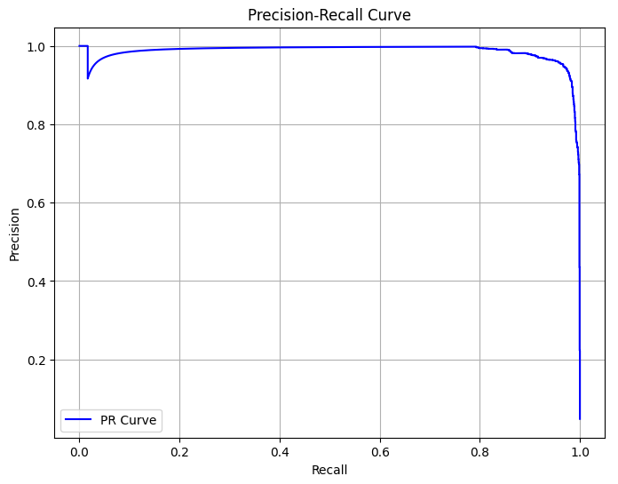

# Variational Autoencoder for Anomaly Detection in KDD Cup 1999 Dataset

This project implements a **Variational Autoencoder (VAE)** for anomaly detection using the **KDD Cup 1999** dataset, focusing on **HTTP service traffic**. The VAE learns the distribution of normal traffic patterns and detects anomalies by measuring reconstruction errors.

---

## Dataset

The dataset used is a subset of the **KDD Cup 1999** dataset, filtered to only include HTTP service data. This helps specialize the model in detecting anomalies in web traffic.

### Preprocessing Steps:
- **Filtered Data**: Extracted records where `service == "http"`.
- **One-Hot Encoding**: Applied to categorical features.
- **Standard Scaling**: Applied to numerical features for normalization.
- **Dataset Split**: The dataset was divided into:
  - **Training** (Only "normal" traffic extracted from the "kddcup.data.corrected" file)
  - **Validation** (Only "normal" traffic extracted from the "kddcup.data.corrected" file)
  - **Test** (Contains both normal and anomalous traffic from the "corrected" file)

---

## Variational Autoencoder (VAE)

A Variational Autoencoder was used to learn the normal HTTP traffic distribution. The VAE consists of:

- **Encoder**:
  - Fully connected layers with ReLU activations.
  - Outputs mean (`μ`) and log variance (`logvar`) for latent space representation.

- **Latent Space Sampling**:
  - A reparameterization was used:  
    `z = μ + ε * exp(0.5 * logvar)`, where `ε` is sampled from a standard normal distribution.

- **Decoder**:
  - Fully connected layers with ReLU activations.
  - Outputs a reconstruction of the original input.

- **Loss Function**:
  - **Reconstruction Loss** (MSE) measures how well the input is reconstructed.
  - **KL Divergence Loss** ensures the learned latent space follows a normal distribution.

---

## Training & Hyperparameters

- **Optimizer**: AdamW
- **Learning Rate**: 0.0001 with a scheduler reducing LR on plateau.
- **Weight Decay**: 0.001
- **Batch Size**: 16 (tried 32 and 64)
- **Epochs**: 50
- **Dropout Probability**: 0.2
- **Number of Latent Dimensions**: 8 (iterated from 2-16)

The best-performing model on the training set, based on validation loss, was saved and loaded for use on the test set. The training progress can be seen below.

## Evaluation Metrics
Anomalies were detected in the test set using **reconstruction loss**. Various percentile thresholds were tested to optimize detection performance.

- **Precision-Recall Curve**: Used to determine the optimal threshold for classifiying a data point as an anomaly.

- **Final Threshold**: 69.2557 selected based on the best F1-score.

### Final Performance:
- **Precision**: 0.9529
- **Recall**: 0.9663
- **F1-Score**: 0.9596

---

## Conclusion

The Variational Autoencoder effectively modeled normal HTTP traffic and detected anomalies with high precision and recall. Future improvements could involve:
- Experimenting with different architectures (e.g., LSTMs for sequential data).
- Using a more advanced anomaly detection method, such as Normalizing Flows or GAN-based models.

---

