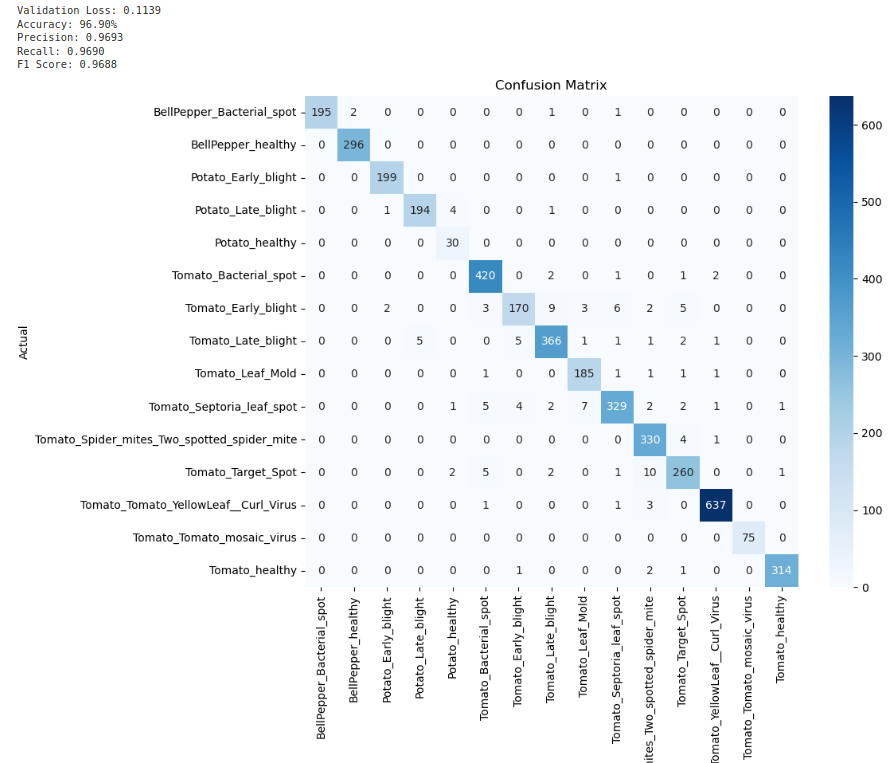

Utilized the PlantVillage dataset from Kaggle: https://www.kaggle.com/datasets/emmarex/plantdisease/data

-Goal was to create a plant disease classification model using the dataset.
-Performed transfer learning with the Resnet50 and VisionTransformer pre-trained models from PyTorch.
-Froze the parameters in the base model, replaced the final layer with a linear model that was trained on the new plant disease dataset. 
-The dataset had some significant class imbalance, so I added a stratified train test split on the initial data split and then used a WeightedRandomSampler for the training batches. 
-image transformations for the training data include: horizontal flip, random color jitter, random rotation, random erasing, gaussian blur
-Due to the class imbalance, the main performance metric used was the F1 score, that takes precision and recall into account. 
-Due to compute/time considerations, I limited the training to 5 epochs with a learning rate of 0.001. With more resources, I would have performed a granular trade study with these hyper-parameters to further improve performance. 
-The architecture is also setup to save the best performing system weights from the training dataset and use them on the validation dataset.
-The VisionTransformer outperformed the Resnet50 with an F1 score of 0.9688 compared to the Resnet's 0.9430.

