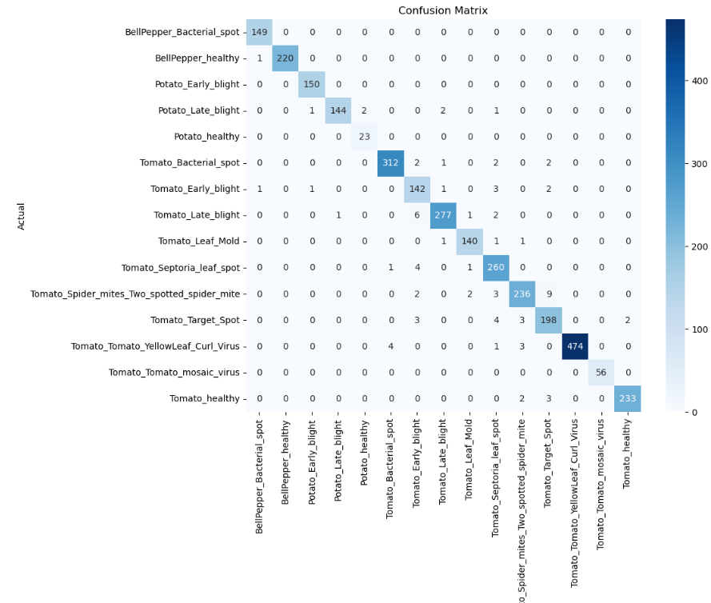

# Plant Disease Classification using Transfer Learning

## Overview
This project aims to classify plant diseases using images from the PlantVillage dataset (from Kaggle: https://www.kaggle.com/datasets/emmarex/plantdisease/data). Two state-of-the-art deep learning architectures were employed: **ResNet50** and **Vision Transformer (ViT)**. The focus was on leveraging transfer learning to address the challenges of class imbalance and achieving robust performance.

---

## Dataset
- **Classes**: Includes healthy and diseased labels for various crops (e.g., tomato, potato, bell pepper).
- **Imbalance**: Class distributions vary significantly, with more diseased samples than healthy ones.

---

## Methodology
### Preprocessing
- Stratified **train/validation/test** split:
  - **Training**: 70%  
  - **Validation**: 20%  
  - **Testing**: 10%
- Image resizing:
  - **ResNet50**: 256x256.  
  - **ViT**: 224x224.

### Data Augmentation
- Applied to training data to improve generalization:
  - Resize, RandomHorizontalFlip, ColorJitter, RandomRotation, RandomErasing, GaussianBlur.

### Model Architectures
#### ResNet50
- Transfer learning from pre-trained ImageNet weights.
- **Modifications**: Replaced the fully connected (fc) layer with a dropout layer (p=0.4) followed by a linear layer for classification.
- Freezing of base layers.

#### Vision Transformer (ViT)
- Pre-trained Vision Transformer (ViT-B/16) from PyTorch.
- **Modifications**: Replaced the `heads.head` layer for fine-tuning with dropout (p=0.4) applied to the linear layer.

### Loss and Optimization
- **Loss function**: Weighted cross-entropy loss to address class imbalance.
- **Optimizer**: AdamW with a learning rate of 0.001 and weight decay of 0.001.
- **Scheduler**: Reduced learning rate by 0.5 if validation loss plateaued for 5 epochs.
- **Save best model**: The weights from the best performing model on the validation data is saved and used on the test data.  

### Evaluation Metrics
Due to class imbalance, performance was evaluated using:
- Accuracy
- Precision
- Recall
- F1 Score (primary focus)

---

## Results
### ResNet50
- **Test Loss**: 0.1682  
- **Accuracy**: 93.73%  
- **Precision**: 0.9406  
- **Recall**: 0.9373  
- **F1 Score**: 0.9367  

### Vision Transformer (ViT)
- **Test Loss**: 0.0825  
- **Accuracy**: 97.35%  
- **Precision**: 0.9741  
- **Recall**: 0.9735  
- **F1 Score**: 0.9736  

---

## Key Takeaways
- The Vision Transformer significantly outperformed ResNet50 across all evaluation metrics, particularly excelling in handling class imbalance.
- Dropout regularization (p=0.4) contributed to improved generalization in both models.

---

## Future Work
- Due to compute/time considerations, I limited the training to 5 epochs with a learning rate of 0.001. With more resources, I would have performed a granular trade study with these hyper-parameters to further improve performance.   

