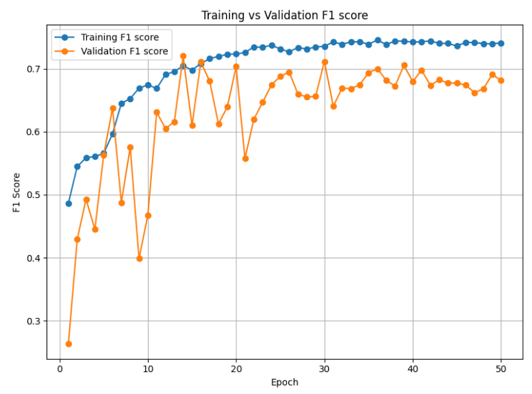
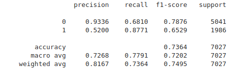

# GRU-based Flow Valve Anomaly Detection Model

## Overview

This project focuses on building a **GRU-based anomaly detection model** for analyzing valve flow experiment data. The goal is to detect anomalies in the flow readings of valves using a time-series dataset. The model leverages **Gated Recurrent Units (GRU)** for sequence modeling, and its performance is evaluated using **F1 score**.

## Data Source
Iurii D. Katser and Vyacheslav O. Kozitsin, “Skoltech Anomaly Benchmark (SKAB).” Kaggle, 2020, doi: 10.34740/KAGGLE/DSV/1693952.

## Class Imbalance
This dataset contains large class imbalance (33619 "normal" samples vs. 13241 anomaly samples).  

## Workflow

1. **Data Preprocessing**:
   - The dataset consists of time-series data organized into multiple subdirectories (`anomaly-free`, `other`, `valve1`, `valve2`).
   - The data is preprocessed by normalizing the values and preparing sequences for input to the GRU model.
   - The data is then split into training/validation/test datasets.

2. **Training**:
   - The GRU-based model is trained using the training/validation data.
   - Hyperparameters, including the length of the sequences of data, are tuned using validation data.

3. **Evaluation**:
   - The model is evaluated using the **validation loss** and **F1 macro score**. The F1 score is used as the primary metric to assess the model's ability to detect both anomalies and normal data in an unbalanced dataset. It is important to use the F1-macro score because it is the unweighted mean of the F1 scores per class, which will give a more accurate understanding of the model's overall performance.

4. **Saving the Best Model**:
   - The best-performing model based on validation F1 score is saved during training and used for evaluation on the test data.

## Model Architecture

The model architecture is based on a bi-directional **GRU (Gated Recurrent Units)**, a type of recurrent neural network (RNN) particularly well-suited for modeling sequential data. GRUs are effective at capturing long-range dependencies in time-series data, making them ideal for detecting anomalies in valve flow experiments.

A bi-directional GRU model was developed with a configurable hidden size, number of layers, and dropout applied.  

### Training Hyperparameters:
- **Training Setup**:
  - **Sequence Length**: Varied from 8-32 rows of data, 16 gave best performance.
  - **Learning Rate**: 0.0005 
  - **Weight decay**: 0.001.
  - **AdamW** optimizer
  - **Dropout**: Increased from 0.2 to 0.3 to prevent overfitting and improve model generalization.
  - **Epochs**: Trained for a total of 50 epochs.
  - **Batch Size**: Increased to 64 for better performance vs 32.
  - **Scheduler**: A learning rate scheduler that reduces the learning rate by 0.5 if the validation F1 score does not improve after 4 epochs.
  - **Loss Function**: Weighted CrossEntropy loss.
  
- **Class Imbalance Handling**: Used a WeightedRandomSampler and CrossEntropyLoss to penalize misclassifications in the minority class more heavily.

## Training Results:
The training progress can be seen below.  
  

## Test Results
After 50 epochs of training, the model achieved the following results on the test data:

- **Accuracy**: 73.64%
- **Precision**: 0.73
- **Recall**: 0.78
- **F1 Score**: 0.72  

  

The per-class metrics indicate that the model is very precise when predicting a sample is not an anomaly, due to its high precision on class 0. It has high recall for the anomaly class, meaning it is not missing a significant amount of anomaly samples. The model has relatively low precision, 0.52, on the anomaly class, however, indicating many false positives are being predicted. This relationship can be tuned based on the goals for the model (high recall vs high precision, what are the consequences of a false positive vs false negative, etc.).  

## Future Improvements

- **Hyperparameter Tuning**: Experimenting with different GRU configurations, batch sizes, and learning rates could improve further improve performance.
- **Model Ensembles**: Combining multiple models (e.g., GRU and other anomaly detection models) could provide more robust results.

## Conclusion

The GRU-based anomaly detection model successfully detects anomalies in valve flow experiment data by learning normal system behavior and identifying deviations. The model provides solid performance in detecting anomalies and offers a robust starting point for future enhancements.
